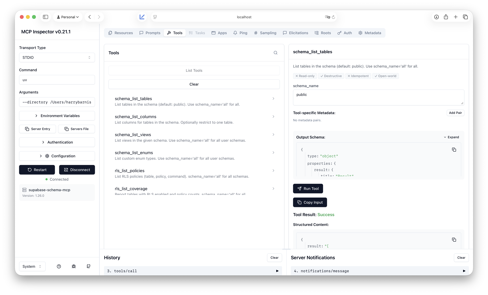

# supabase-schema-mcp



An MCP server that provides deep schema introspection for Supabase/Postgres. I built it because the [official Supabase MCP](https://github.com/supabase/supabase-mcp) focuses on project overview, branches, and API usage; it does not expose the kind of schema detail needed for migrations, RLS audits, relationship graphs, or RPC/trigger discovery.

## Why this exists (limitations of Supabase’s MCP)

The official Supabase MCP is great for project-level and API workflows. It does not, however, give tools or agents fine-grained access to your **database schema**: tables, columns, views, enums, RLS policies, functions/RPCs, foreign keys, indexes, and triggers. If you want an AI or tool to reason about your schema (e.g. “which tables have RLS?”, “what does this RPC look like?”, “what FKs reference this table?”), you either run custom SQL yourself or use something that introspects the DB. This server fills that gap by connecting directly to your Supabase Postgres and exposing schema-only, read-only tools.

## What this one does that Supabase’s doesn’t

- **Schema introspection only**: tables, columns, views, enums, RLS policies (and coverage), functions (including RPC candidates), foreign keys, indexes, triggers.
- **No project/API scope**: no branches, no API calls; just database structure. Use the official MCP for project management; use this one when you need schema metadata.
- **Read-only**: designed for introspection only; no writes or DDL. Suited to a read-only Postgres role.

Full tool list and parameters are in [**Tools reference**](docs/tools-reference.md).

## Setup

1. Clone the repo. All commands below must be run from the **repo root** (the directory that contains `pyproject.toml` and `src/`).
2. Create a virtual environment and install dependencies with **uv**:
   ```bash
   uv sync --extra dev
   ```
3. Copy `.env.example` to `.env` and set your Supabase Postgres connection:
   - **Required**: `SUPABASE_DB_HOST` (e.g. `db.<project_ref>.supabase.co`), `SUPABASE_DB_USER` (usually `postgres`), `SUPABASE_DB_PASSWORD` (from Project Settings > Database)
   - Optional: `SUPABASE_DB_PORT`, `SUPABASE_DB_NAME`
4. From the **repo root**, run the MCP server over stdio:
   ```bash
   uv run python -m supabase_schema_mcp.server
   ```
   Or use the script entry point:
   ```bash
   uv run supabase-schema-mcp
   ```

### Adding as an MCP in Cursor

1. Open Cursor **Settings** (e.g. **Cursor > Settings** or `Cmd+,`).
2. Search for **MCP** or open **Features > MCP**.
3. Add this server via the JSON config. Edit **`~/.cursor/mcp.json`** (or your project's `.cursor/mcp.json`) and add a `supabase-schema-mcp` entry under `mcpServers`. Replace `PATH_TO_SUPABASE_SCHEMA_MCP` with the full path to the **repo root** (the folder that contains `pyproject.toml` and `src/`):

   ```json
   {
     "mcpServers": {
       "supabase-schema-mcp": {
         "command": "uv",
         "args": [
           "--directory",
           "PATH_TO_SUPABASE_SCHEMA_MCP",
           "run",
           "python",
           "-m",
           "supabase_schema_mcp.server"
         ]
       }
     }
   }
   ```

   Example with a real path (macOS):

   ```json
   {
     "mcpServers": {
       "supabase-schema-mcp": {
         "command": "uv",
         "args": [
           "--directory",
           "/Users/you/Developer/supabase-mcp",
           "run",
           "python",
           "-m",
           "supabase_schema_mcp.server"
         ]
       }
     }
   }
   ```

4. Restart Cursor (MCP servers load at startup). When the server starts, you should see on stderr: `supabase-schema-mcp server started (stdio)`. Any config warnings appear in a yellow panel above that.

5. You do **not** need to run the server in a terminal yourself. Cursor starts and manages the process when it needs to call the tools.

## Read-only safety model

This MCP server is designed to **read** schema and metadata only. It does not execute arbitrary writes or DDL. Database access should use a **read-only** Postgres role where possible; the connection layer enforces that only introspection-style, read-only operations are performed. Management API usage is limited to reading project/config data as needed. Never put a role with write or DDL privileges into this server's configuration unless you explicitly require it for a future feature.
